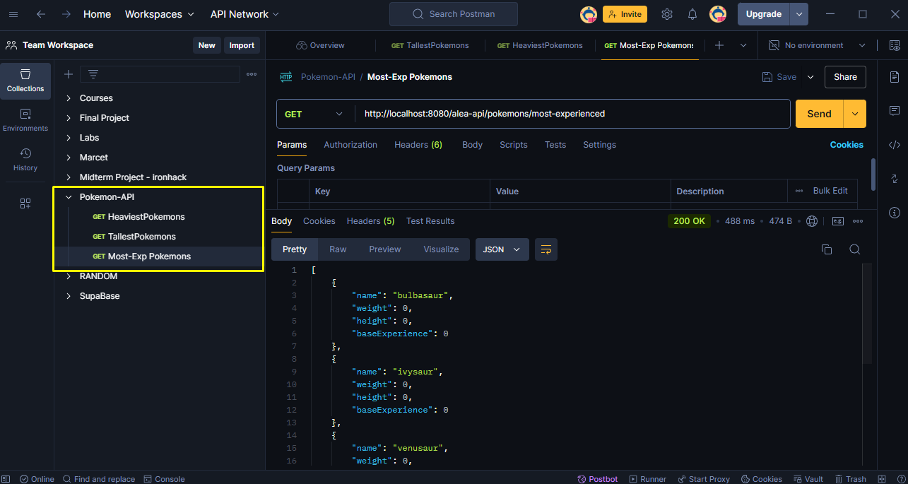

# Pokémon API

## Descripción

Este proyecto es una aplicación Java Spring Boot que expone una API para obtener información sobre los Pokémon utilizando la [PokéAPI](https://pokeapi.co/api/v2/). La aplicación está diseñada siguiendo los principios de la arquitectura hexagonal y SOLID para garantizar un código limpio, mantenible y escalable.

## Estructura del Proyecto

La estructura del proyecto sigue el patrón de arquitectura hexagonal, también conocida como Ports and Adapters, para mantener una separación clara entre las distintas capas y facilitar la extensibilidad y mantenimiento del código.

```plaintext
src
└── main
    ├── java
    │   └── com
    │       └── alea
    │           └── pokemonapi
    │               ├── config
    │               │   └── SwaggerConfig.java
    │               ├── controller
    │               │   └── PokemonController.java
    │               ├── domain
    │               │   ├── Pokemon.java
    │               │   └── PokemonStatistics.java
    │               ├── service
    │               │   └── PokemonService.java
    │               └── application
    │                   ├── PokemonServiceImpl.java
    │                   └── PokemonUseCase.java
    └── resources
        ├── application.properties
```
## Arquitectura Hexagonal

La arquitectura hexagonal, o Ports and Adapters, es una forma de organizar el código que se enfoca en separar la lógica de negocio del código que interactúa con el mundo exterior. En esta aplicación, hemos implementado esta arquitectura de la siguiente manera:

- **Dominio**: Contiene las entidades del negocio (`Pokemon` y `PokemonStatistics`) y las interfaces de los casos de uso (`PokemonUseCase`). Esta capa representa el núcleo de la lógica de negocio y no depende de ningún detalle externo.

- **Aplicación**: Contiene la implementación de los casos de uso (`PokemonServiceImpl`) que orquesta la lógica de negocio y delega en las interfaces del dominio. También implementa la lógica para interactuar con el adaptador externo.

- **Controlador**: Expone las APIs REST a los clientes y utiliza el servicio para realizar operaciones. Los controladores (`PokemonController`) actúan como adaptadores que convierten las solicitudes HTTP en llamadas a la lógica de negocio.

- **Adaptadores**: Implementan la comunicación con servicios externos como PokéAPI. En este caso, se ha utilizado Feign para integrar la PokéAPI y obtener datos sobre los Pokémon.

## Principios SOLID

La implementación de SOLID ayuda a crear un código que es más fácil de entender, mantener y extender:

- **S - Single Responsibility Principle (SRP)**: Cada clase en el proyecto tiene una única responsabilidad. Por ejemplo, los controladores manejan solicitudes HTTP, mientras que los servicios gestionan la lógica de negocio.

- **O - Open/Closed Principle (OCP)**: El código está diseñado para ser extendido sin modificar las clases existentes. Por ejemplo, se pueden agregar nuevos casos de uso o adaptadores sin cambiar el código existente.

- **L - Liskov Substitution Principle (LSP)**: Las clases derivadas pueden ser sustituidas por sus clases base sin alterar el comportamiento esperado. Este principio se aplica en la implementación de interfaces y en la herencia de clases.

- **I - Interface Segregation Principle (ISP)**: Las interfaces están diseñadas para ser específicas y no obligan a las clases a implementar métodos que no utilizan. Por ejemplo, las interfaces del dominio están diseñadas para operaciones específicas.

- **D - Dependency Inversion Principle (DIP)**: El código depende de abstracciones, no de implementaciones concretas. Las dependencias se inyectan en lugar de ser creadas dentro de las clases.

## Swagger

Swagger se ha integrado para proporcionar documentación interactiva para la API. La configuración de Swagger se encuentra en `SwaggerConfig.java`, y se ha utilizado Springfox para este propósito. La documentación puede ser accedida en:

- **Swagger UI**: [http://localhost:8080/swagger-ui/](http://localhost:8080/swagger-ui/)

## Configuración del Proyecto

Para ejecutar el proyecto, asegúrate de tener instalado Java 17 y Gradle. Puedes iniciar la aplicación y la documentación Swagger con los siguientes comandos:

```bash
./gradlew clean build
./gradlew bootRun
```
## Imágenes de las respuestas de Postman

